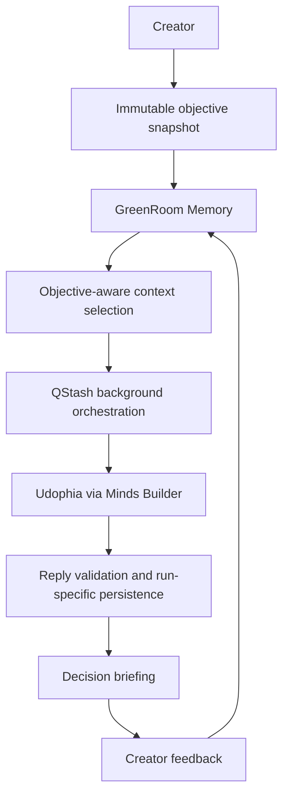

# GreenRoom

**Persistent decision intelligence for solo creators.**

GreenRoom is a persistent AI decision layer that remembers creator preferences, objectives, feedback, and prior decisions. A creator sets an objective; GreenRoom selects relevant context, orchestrates background work through its real Minds integration, and returns a concise decision briefing: **what changed, why it matters, and what to do next**.

> Product thesis, not validated market evidence: creators need intelligence that remembers a career, not merely an AI conversation. External creator validation is still pending.

## The Problem

Solo creators simultaneously manage production, tools, audience growth, monetization, and workflow decisions. Most AI tools solve isolated tasks and repeatedly ask the creator to reconstruct their goals, preferences, and rejected options. That creates decision overhead precisely where an independent creator has the least spare attention.

## The Insight

AI remembers a conversation. Creators need intelligence that remembers a career.

GreenRoom's differentiation is **persistent creator decision memory**: what the creator values, how they work, what they rejected, what they decided, and which objective is active.

## What GreenRoom Does

```text
objective → relevant persistent memory → background intelligence
          → actionable briefing → creator feedback → future memory
```

GreenRoom is not primarily a content generator, generic chatbot, social scheduler, moderation tool, dashboard collection, or fictional team of remote specialist Minds.

## The Decision Briefing

Every completed briefing uses the existing internal contract:

- **WHAT CHANGED** — the relevant finding.
- **WHY IT MATTERS** — its significance for this creator and objective.
- **WHAT TO DO NEXT** — a practical next action.

## Why Minds

Persistence is central, not decorative. GreenRoom supplies the real platform Mind with objective-bound creator context and treats a response as usable only after identity and reply validation. The application keeps objectives, memory, run lifecycle, and delivery separate from the platform conversation so failures cannot silently become successful briefings.

## Architecture



GreenRoom orchestration owns objective validation, simulated-signal classification, queue lifecycle, reply verification, run isolation, and delivery. GreenRoom Memory is the application's creator-profile and decision-memory layer. Neither is represented as a separate platform Mind.

## Real Minds Integration

- Verified platform identity: `udophia@hellominds.ai`
- Mind UUID: `8208493e-f36b-1410-8466-00039ce7df11`
- Official client: `@animocabrands/minds-client-lib`
- Confirmed source usage: `createMindsClient`, `getMind`, `ensureConversation`, `getLatestHistoryFingerprint`, `sendMessage`, `waitForReply`, and `getHistory`

No Builder credential is stored in documentation or source control.

## Persistence and Memory

The memory model stores creator identity context, preferences, constraints, learned voice rules, objectives, feedback, decision history, and briefing references. Local development uses file-backed persistence; production supports Upstash Redis (including the Vercel KV-compatible aliases used by the source). Relevant memory is selected for execution without deleting the full durable profile.

## Background Execution

Production submission creates a run-specific immutable objective snapshot, publishes a signed job through Upstash QStash, and returns without requiring the browser to remain open. The Node worker verifies QStash signatures, calls Minds Builder, collects verified replies through SSE and/or conversation history, and persists terminal state.

## Run Isolation

Each run has its own `run_id`, objective ID and fingerprint, status, conversation metadata, and briefing key. `latest_briefing` is a convenience pointer; it is not allowed to substitute another run's result. `FAILED` and `COMPLETED` are terminal.

## Evidence Integrity

The current objective-aware evidence bundle is a **Demo Dataset (Simulated)**. GreenRoom does not currently claim live research, current URLs, current pricing, adoption data, or live market discovery. Simulated evidence and real Mind execution are different provenance dimensions and must remain visibly distinct.

## Current Technical Constraint

Foundation testing proved Builder authentication, Udophia identity retrieval, conversation creation, message submission, successful SSE replies, and durable history visibility. It also found inconsistent reply generation for creator-intelligence tasks, especially—but not exclusively—when more context was supplied. The upstream cause was not conclusively established; it is a post-hackathon reliability and observability priority.

## Built for Creative Minds Jam #1

GreenRoom explores a Minds-native creator problem: maintaining decision continuity while a solo creator is producing, publishing, and operating a business. The demo should prove memory, objective binding, honest background state, and run-specific delivery—not imply product-market validation that has not occurred.

## Who It Is For

The primary user is a solo or independent digital creator who makes recurring tool, workflow, audience, growth, and monetization decisions without a dedicated strategy team.

## Post-Hackathon Direction

Near-term work focuses on Minds execution reliability, creator interviews, instrumentation, and the first real external creator-data integration. Planned capabilities are documented in [ROADMAP.md](ROADMAP.md); canonical requirements live in [PRD.md](PRD.md).

## Local Development

Prerequisites: Python, Node.js, npm, and credentials only for the integrations you intend to exercise.

```bash
python -m venv .venv
# Windows: .venv\Scripts\activate
# macOS/Linux: source .venv/bin/activate
pip install -r requirements.txt
npm install
npm --prefix frontend install
```

Required production environment names, without values:

```text
MINDS_BUILDER_API_KEY
QSTASH_TOKEN
QSTASH_CURRENT_SIGNING_KEY
QSTASH_NEXT_SIGNING_KEY
UPSTASH_REDIS_REST_URL
UPSTASH_REDIS_REST_TOKEN
```

`KV_REST_API_URL` and `KV_REST_API_TOKEN` are supported persistence aliases. `DEMO_MODE=true` explicitly enables local mock behavior in the Python integration; mock output must never be presented as production execution.

```bash
python server.py
npm --prefix frontend run dev
```

Relevant verification commands:

```bash
python test_greenroom.py
python test_memory_persistence.py
python test_objective_bound_runs.py
node --test api/*.test.mjs frontend/src/lib/*.test.js
npm --prefix frontend run build
```

## Security

- `.env` and `.env.*` files are ignored and must never be committed.
- Never print Builder, QStash, Redis, or other credentials.
- Production worker requests require QStash signature verification.
- Missing credentials, invalid Mind identity, invalid replies, and persistence mismatches must fail loudly.
