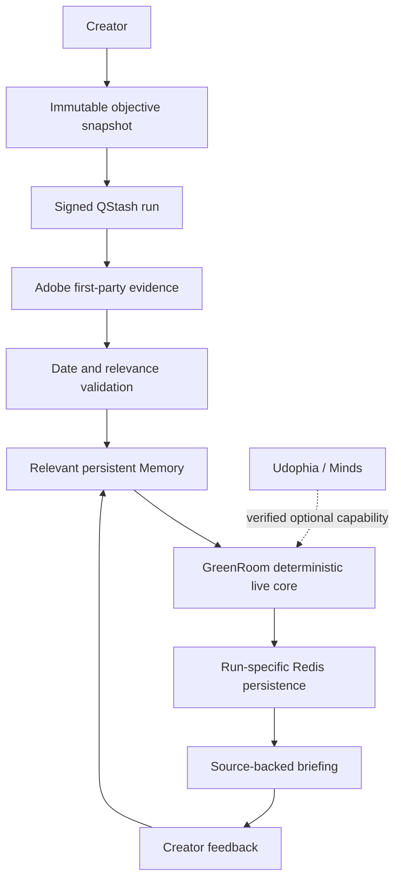

# GreenRoom

**Persistent decision intelligence for solo creators.**

Live product: https://greenroom-ruby.vercel.app

GreenRoom keeps a creator objective, relevant preferences, feedback, and prior decisions connected across background runs. AI video is its first acceptance-test vertical, not the product's identity. Its initial supported live objective is deliberately narrow:

> Keep me updated on important AI video tools that could improve my workflow.

The product retrieves current first-party evidence, applies conservative relevance and freshness rules, returns a source-backed decision briefing, persists the exact run, and carries creator feedback into later Memory selection.

> Product thesis, not validated market evidence: creators need decision intelligence that remembers a career rather than only a conversation. External creator validation remains in progress.

## What works today

- Durable creator profile, objectives, preferences, feedback, and briefing history
- Immutable objective snapshots and SHA-256 fingerprints
- Signed QStash background delivery and Upstash Redis persistence
- Run-specific status and briefing records with duplicate-delivery protection
- Live Adobe Blog evidence for the supported AI-video objective
- Strict rejection of malformed, future, stale, and weakly related evidence
- Source title, URL, publication time, and retrieval time preserved through delivery
- Truthful `QUEUED`, `WORKING`, `RESULT READY`, `NO RELEVANT UPDATE`, and `RUN FAILED` states
- Verified Udophia identity and official Minds Builder conversation/SSE/history integration

## Live evidence lifecycle

```text
creator objective
  → immutable run snapshot
  → signed background worker
  → Adobe official Blog query index
  → strict AI-video relevance + 365-day freshness filter
  → normalized source record
  → relevant persistent Memory selection
  → deterministic GreenRoom briefing
  → run-specific persistence
  → creator feedback
  → later Memory selection
```

The evidence layer classifies a supported objective domain and selects providers from a small registry. Today `AI_VIDEO` maps to `ADOBE_BLOG`. The worker, Memory, persistence, briefing, feedback, and frontend consume normalized evidence and do not need Adobe-specific fields. Future domains can register providers without rewriting that lifecycle.

The first live provider is intentionally not a generic crawler. It supports official Adobe article metadata related to AI video creation, Firefly video, generative video, video generation, AI video editing, AI animation, or AI filmmaking. False negatives are preferred to unrelated claims. Unsupported objectives remain saved but return `NO LIVE PROVIDER`; they never receive substituted AI-video evidence.

If the source is unavailable or malformed, the run fails safely. If the source works but no current item passes the filters, the run becomes `NO_RELEVANT_UPDATE`. Neither outcome substitutes simulated evidence or an older briefing.

## Decision briefing

Every successful live item exposes:

- **WHAT CHANGED** — a conservative transformation of verified source metadata
- **WHY IT MATTERS** — the explicit match between the AI-video evidence and active objective, with no broader impact inferred
- **WHAT TO DO NEXT** — a bounded instruction to inspect and compare the first-party source
- **SOURCE** — first-party name, article title, URL, and publication date

This content is generated by `GREENROOM_DETERMINISTIC_LIVE_CORE`. It is not represented as an Udophia answer. A selected saved preference may be attached as an evaluation constraint; this proves Memory selection, not changed AI reasoning.

## Persistent Memory

GreenRoom stores the complete durable creator profile while projecting only relevant context into a run. Memory includes creator facts, objectives, explicit preferences, item feedback, decision references, and provenance-bearing Memory nodes.

Feedback such as `Prefer free or low-cost tools.` becomes a durable rule and Memory node. A later AI-video tools run can select that rule without rewriting earlier briefings.

## Udophia and Minds

- Verified Mind: `udophia@hellominds.ai`
- Mind UUID: `8208493e-f36b-1410-8466-00039ce7df11`
- Official client: `@animocabrands/minds-client-lib`
- Preserved capabilities: identity verification, conversations, message submission, SSE replies, durable history, and strict response validation

Udophia has produced verified responses in bounded diagnostics, but reply generation has not been reliable enough to be the mandatory completion dependency of every live run. The integration remains available and tested; deterministic live briefings explicitly set `minds_verified: false` and `minds_involved: false`.

## Run isolation and persistence

Each run has its own ID, objective ID, objective fingerprint, status, evidence metadata, selected-Memory metadata, and briefing key. `latest_briefing` is a convenience pointer only. The frontend accepts a current result only when its run ID, objective ID, and fingerprint match the active completed run.

Historical simulated briefings are never rewritten and remain labeled `DEMO DATASET — SIMULATED`.

## Architecture



## Local setup

Prerequisites: Python, Node.js 22+, npm, and credentials for the integrations being exercised.

```bash
python -m venv .venv
# Windows: .venv\Scripts\activate
# macOS/Linux: source .venv/bin/activate
pip install -r requirements.txt
npm install
npm --prefix frontend install
```

Copy `.env.example` to an ignored local environment file and provide values only there. Production live execution requires:

```text
QSTASH_TOKEN
QSTASH_CURRENT_SIGNING_KEY
QSTASH_NEXT_SIGNING_KEY
UPSTASH_REDIS_REST_URL
UPSTASH_REDIS_REST_TOKEN
```

`KV_REST_API_URL` and `KV_REST_API_TOKEN` are supported Redis aliases. `QSTASH_URL` is optional. `MINDS_BUILDER_API_KEY` enables the preserved Udophia integration but is not required by the deterministic live worker. Frontend API/WebSocket overrides are optional.

`DEMO_MODE=true` enables explicitly separate local demo behavior. Demo output must never be represented as live evidence.

```bash
python server.py
npm --prefix frontend run dev
```

## Verification

```bash
python test_greenroom.py
python test_memory_persistence.py
python test_objective_bound_runs.py
node --test api/*.test.mjs frontend/src/lib/*.test.js
npm --prefix frontend run build
```

## Known limitations

- Live evidence currently supports one acceptance-test domain (`AI_VIDEO`) and one first-party provider (`ADOBE_BLOG`). GreenRoom remains persistent creator decision intelligence, not an AI-video tracker.
- Writing, images/design, audio/podcasting, publishing, audience/growth, and other creator domains do not yet have live providers and return a truthful unsupported state.
- Adobe’s query index is public infrastructure without a GreenRoom-controlled availability guarantee.
- Relevance is conservative and deterministic; relevant articles can be omitted rather than risking false positives.
- GreenRoom does not infer pricing, adoption, availability, performance, or strategic impact absent source evidence.
- Udophia reply generation remains inconsistent and is not used to claim completion of deterministic live briefings.
- Sustained production concurrency, source stability, and production latency distributions need further measurement.
- The product thesis still requires creator interviews and behavioral validation.

## Security

- `.env` and `.env.*` files are ignored; `.env.example` contains names only.
- Builder, QStash, Redis, and other credentials must never enter source control or diagnostics.
- Production worker requests require QStash signature verification.
- Persistence mismatches, source failures, malformed evidence, and invalid Minds replies fail safely.
